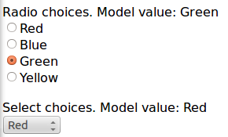

With Wicket it's quite easy to build a callback URL that is handled on server side by a component or a behavior. What we have to do is to implement interface _org.apache.wicket.IRequestListener_:

[source,java]
----
public interface IRequestListener extends IClusterable
{

	/**
	 * Does invocation of this listener render the page. 
	 * 
	 * @return default {@code true}, i.e. a {@link RenderPageRequestHandler} is schedules after invocation 
	 */
	default boolean rendersPage()
	{
		return true;
	}
	
	/**
	 * Called when a request is received.
	 */
	void onRequest();
}
----

Method _onRequest_ is the handler that is executed to process the callback URL while _rendersPage_ tells if the whole page should be re-rendered after _onRequest_ has been executed (if we have a non-AJAX request).

An example of a component that implements _IRequestListener_ can be seen in the Wicket standard link component. Here is an excerpt from its code:

[source,java]
----
public abstract class Link<T> extends AbstractLink implements IRequestListener ... 
{
	/**
	 * Called when a link is clicked.
	 */
	public abstract void onClick();

	/**
	 * THIS METHOD IS NOT PART OF THE WICKET API. DO NOT ATTEMPT TO OVERRIDE OR CALL IT.
	 * 
	 * Called when a link is clicked. The implementation of this method is currently to simply call
	 * onClick(), but this may be augmented in the future.
	 */
	@Override
	public void onRequest()
	{
		// Invoke subclass handler
		onClick();
	}
}
----

Callback URLs can be generated with _Component_'s method _urlFor(PageParameters)_ or with method _urlFor (Behavior, RequestListenerInterface, PageParameters)_ if we are using a callback interface with a behavior (see the following example).

Project _CallbackURLExample_ contains a behavior (class _OnChangeSingleChoiceBehavior_) that implements _org.apache.wicket.IRequestListener_ to update the model of an _AbstractSingleSelectChoice_ component when user changes the selected option (it provides the same functionality of method _wantOnSelectionChangedNotifications_). 
The following is the implementation of _onRequest()_ provided by _OnSelectionChangedNotifications_:

[source,java]
----
@Override
public void onRequest() {	
	Request request = RequestCycle.get().getRequest();
	IRequestParameters requestParameters = request.getRequestParameters();
	StringValue choiceId = requestParameters.getParameterValue("choiceId");
	//boundComponent is the component that the behavior it is bound to.
	boundComponent.setDefaultModelObject( convertChoiceIdToChoice(choiceId.toString()));
}
----

When invoked via URL, the behavior expects to find a request parameter (choiceId) containing the id of the selected choice. This value is used to obtain the corresponding choice object that must be used to set the model of the component that the behavior is bound to (boundComponent). Method _convertChoiceIdToChoice_ is in charge of retrieving the choice object given its id and it has been copied from class _AbstractSingleSelectChoice_.

Another interesting part of _OnChangeSingleChoiceBehavior_ is its method _onComponentTag_ where some JavaScript “magic” is used to move user's browser to the callback URL when event “change” occurs on bound component:

[source,java]
----
@Override
public void onComponentTag(Component component, ComponentTag tag) {
	super.onComponentTag(component, tag);
		
	CharSequence callBackURL = getCallbackUrl();
	String separatorChar = (callBackURL.toString().indexOf('?') > -1 ? "&" : "?");
		
	String finalScript = "var isSelect = $(this).is('select');\n" +
				 "var component;\n" +	
				 "if(isSelect)\n" +
				 "	component = $(this);\n" +
				 "else \n" +
				 "	component = $(this).find('input:radio:checked');\n" +
				 "window.location.href='" + callBackURL +  separatorChar + 
				 "choiceId=' + " + "component.val()";
		
	tag.put("onchange", finalScript);
}
----

The goal of _onComponentTag_ is to build an onchange handler that forces user's browser to move to the callback URL (modifing standard property window.location.href). Please note that we have appended the expected parameter (choiceId) to the URL retrieving its value with a JQuery selector suited for the current type of component (a drop-down menu or a radio group). Since we are using JQuery in our JavaScript code, the behavior comes also with method _renderHead_ that adds the bundled JQuery library to the current page.

Method _getCallbackUrl()_ is used to generate the callback URL for our custom behavior: 

[source,java]
----
public CharSequence getCallbackUrl() {
	if (boundComponent == null) {
		throw new IllegalArgumentException(
			"Behavior must be bound to a component to create the URL");
	}

	return boundComponent.urlForListener(this, new PageParameters());
}
----

The home page of project _CallbackURLExample_ contains a _DropDownChoice_ and a _RadioChoice_ which use our custom behavior. There are also two labels to display the content of the models of the two components:

NOTE: Implementing interface _IRequestListener_ makes a behavior stateful because its callback URL is specific for a given instance of component.

