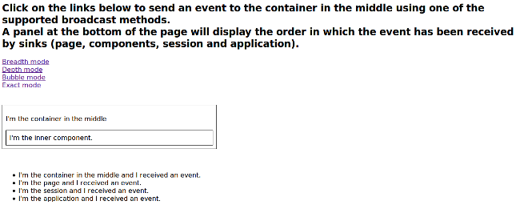

Starting from version 1.5 Wicket offers an event-based infrastructure for inter-component communication. The infrastructure is based on two simple interfaces (both in package _org.apache.wicket.event_) : _IEventSource_ and _IEventSink_. 

The first interface must be implemented by those entities that want to broadcast en event while the second interface must be implemented by those entities that want to receive a broadcast event.

The following entities already implement both these two interfaces (i.e. they can be either sender or receiver): _Component_, _Session_, _RequestCycle_ and _Application_.
_IEventSource_ exposes a single method named send which takes in input three parameters:

* *sink*: an implementation of _IEventSink_ that will be the receiver of the event. 
* *broadcast*: a _Broadcast_ enum which defines the broadcast method used to dispatch the event to the sink and to other entities such as sink children, sink containers, session object, application object and the current request cycle. It has four possible values:
|===
|*Value* | *Description*
|BREADTH | The event is sent first to the specified sink and then to all its children components following a breadth-first order.
|DEPTH | The event is sent to the specified sink only after it has been dispatched to all its children components following a depth-first order.
|BUBBLE | The event is sent first to the specified sink and then to its parent containers.
|EXACT | The event is sent only to the specified sink.
|===
* *payload*: a generic object representing the data sent with the event.

Each broadcast mode has its own traversal order for _Session_, _RequestCycle_ and _Application_. See JavaDoc of class _Broadcast_ for further details about this order.

Interface _IEventSink_ exposes callback method _onEvent(IEvent<?> event)_ which is triggered when a sink receives an event. The interface _IEvent_ represents the received event and provides getter methods to retrieve the event broadcast type, the source of the event and its payload. Typically the received event is used checking the type of its payload object:

[source,java]
----
@Override
public void onEvent(IEvent event) {
  //if the type of payload is MyPayloadClass perform some actions 
  if(event.getPayload() instanceof MyPayloadClass) {
     //execute some business code.
  }else{
     //other business code
  }         
}
----

Project _InterComponetsEventsExample_ provides a concrete example of sending an event to a component (named 'container in the middle') using all the available broadcast methods:

