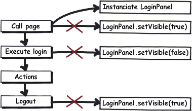

Visibility of components is an important topic. In Wicket you control any component's visibility via the methods _isVisible()_ and _setVisible()_. These methods are within Wicket's base class _Component_ and therefore it is applicable for every component and page. Let's have a look at a concrete example of _LoginBoxPanel_. The panel just gets displayed when the user is not logged in.

*Listing 6:*

[source,java]
----
// Poor implementation
LoginBoxPanel loginBox = new LoginBoxPanel("login");
loginBox.setVisible(MySession.get().isNotLoggedIn());
add(loginBox);
----

Listing 6 shows a poor implementation, because a decision about the visibility is made while instanciating the component. Again, in Wicket instances of components exist for several requests. To reuse the same instance you have to call _loginBox.setVisible(false)_. This is very unhandy, because we always have to call _setVisible()_ and manage the visibility. Furthermore you are going to duplicate the states, because visible is equal to  [not logged in] So we have two saved states, one for the business aspect  [not logged in] and one for the technical aspect  [visible] Both is always equal. This approach is error-prone and fragile, because we always have to pay attention to setting the correct information every time. But this is often forgotten because the logic is widely spread over the code. The solution is the Hollywood principle:  [Don't call us, we'll call you.] Take a look at the following diagram illustrating an application flow with some calls. We avoid three calls through the  http://en.wikipedia.org/wiki/Hollywood_Principle[Hollywood-Principle] and we just have to instanciate the _LoginBoxPanel_.

*Listing 7:*

[source,java]
----
public class LoginBoxPanel {
    // constructor etc.
    @Override
    public boolean isVisible() {
        return MySession.get().isNotLoggedIn();
    }
};
----

Now the control over visibility has been inverted, the _LoginBoxPanel_ decides on its visibility autonomously. For each call of _isVisible()_ there is a refreshed interpretion of the login state. Hence, there is no additional state that might be outdated. The logic is centralized in one line code and not spread throughout the application. Furthermore, you can easily identify that the technical aspect _isVisible()_ correlates to the business aspect  [logged in] The same rules can be applied to the method _isEnabled()_. If _isEnabled()_ returns false the components get displayed in gray. Forms which are within an inactive or invisible component do not get executed.

Note that there are cases in which you cannot avoid to call the methods _setVisible()_ and _setEnabled()_. An example: The user presses a button to display an inlined registration form. In general, you can apply the following rules: data driven components override these methods and delegates to the data model. User triggered events call the method _setVisible(boolean)_. You can also override these methods with inline implementations:

*Listing 8:*

[source,java]
----
new Label("headline", headlineModel) {
    @Override
    public boolean isVisible() {
        // Hidden headline if text starts with "Berlusconi"
        String headline = getModelObject();
        return headline.startWith("Berlusconi");
    }
}
----

*Note:* Some people insist on overriding _isVisible()_ being http://www.mail-archive.com/dev\@wicket.apache.org/msg07123.html[a bad thing]

