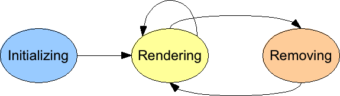

During its life a Wicket component goes through the following stages:

1. *Initialization:* a component is instantiated and initialized by Wicket.
2. *Rendering:* components are prepared for rendering and generate markup. If a component contains children (i.e. is a subclass of _MarkupContainer_) their rendering result is included in the resulting markup.
3. *Removed:* this stage is triggered when a component is explicitly removed from its component hierarchy, i.e. when its parent invokes _remove(component)_ on it. This stage is facultative and is never triggered for pages.
3. *Detached:* after request processing has ended all components are notified to detach any state that is no longer needed. 

The following picture shows the state diagram of component lifecycle:

Once a component has been removed it could be added again to a container, but the initialization stage won't be executed again - it is easier to just create a new component instance instead.

NOTE: If you read the JavaDoc of class _Component_ you will find a more detailed description of component lifecycle.
However this description introduces some advanced topics we didn't covered yet hence, to avoid confusion, in this chapter some details have been omitted and they will be covered later in the next chapters. 

For now you can consider just the simplified version of the lifecycle described above.

