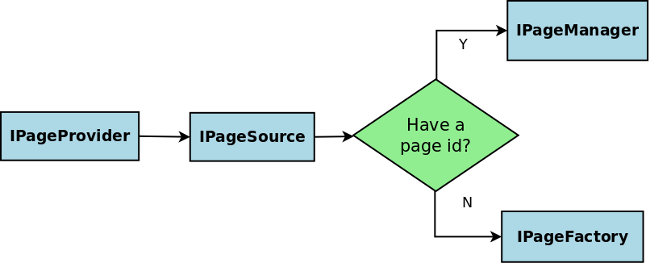

During request handling, Wicket manages page instances through interface _org.apache.wicket.request.handler.IPageProvider_. This interface creates a new page instance or loads a previously serialized page instance if we provide the corrisponding page id. _IPageProvider_ delegates page creation and retrieval to interface _org.apache.wicket.request.mapper.IPageSource_.
When page class is provided _IPageSource_ delegates page creation to interface _org.apache.wicket.IPageFactory_, while when page id is provided it uses interface _org.apache.wicket.page.IPageManager_ to load the previously serialized page.

The following workflow diagram summarizes the mechanism seen so far:

=== IPageManager

_org.apache.wicket.page.IPageManager_'s task is to manage which pages have been used in a request and store their last state in the backing stores, namely _IPageStore_.
The default implementation _org.apache.wicket.page.PageManager_ uses a chain of _IPageStore_ to collect all stateful pages which have been used in the request cycle and store them for a later use. 

NOTE: Keep in mind that more than one page can be used in a single request if, for example, _setResponsePage()_ or _RestartResponseException_ are used.

As said on <<versioningCaching.adoc#_page_caching,paragraph 8.2.4>> stateful pages are stored in a session-relative file using a two-levels cache to speedup the access. This process is made possible by the different implementations of _IPageStore_ that are part of the default chain and that will be introduced in the next paragraph.

NOTE: Wicket gets the default _IPageManager_ using a supplier interface called _IPageManagerProvider_,hence to use a custom _IPageManager_ implementation we must register a specific _IPageManagerProvider_ via _org.apache.wicket.Application.setPageManagerProvider(IPageManagerProvider)_.

=== Default IPageStore chain

_org.apache.wicket.pageStore.IPageStore_'s role is to mediate the storing and loading of page instances. The default chain of _IPageStore_ used by Wicket contains the following ordered list of _IDataStore_:

* *RequestPageStore:* collect all page instances involved in the last request. During the detach stage, stateful pages are passed to the othr steps of the chain to be persisted on file. 
* *InSessionPageStore:* with _InSessionPageStore_ the default chain keeps the last rendered page instance into the HTTP session for fast access. 
* *SerializingPageStore:* _SerializingPageStore_ turns page instances into a more serialization-friendly format represented by class _org.apache.wicket.pageStore.SerializedPage_. This is a struct of:

[source,java]
----
{
   pageType: String,
   pageId : int,
   data : byte[]
}
----

i.e. this is the serialized page instance (data) plus additional information needed to be able to easily find it later (pageId, pageType).

* *AsynchronousPageStore:* The role of _AsynchronousPageStore_ is to detach the http worker thread from waiting for the write of the page bytes to the disk. To disable it use: _org.apache.wicket.settings.StoreSettings.setAsynchronous(false)_. _AsynchronousPageStore_ can delay the storage of page's bytes for at most _org.apache.wicket.settings.StoreSettings.setAsynchronousQueueCapacity(int)_ pages. If this capacity is exceeded then the page's bytes are written synchronously to the backing _IPageStore_.

* *CryptingPageStore:* page instances might contain sensible informations, therefore it's important to have the chance to encrypt their content before persist them on disk. _CryptingPageStore_ encrypts _SerializedPage_'s with a 256 bit AES before passing them to the underling _DiskPageStore_. Buy default this stage is disabled and not added to the default chain. To change this behavior we can use _org.apache.wicket.settings.StoreSettings.setEncrypted_.

* *DiskPageStore:* stores _SerializedPage_ on a session-scoped file on disk. The location of the folder where the files are stored is configurable via _org.apache.wicket.settings.StoreSettings.setFileStoreFolder(File)_, by default the web container's work folder is used (ServletContext attribute 'javax.servlet.context.tempdir'). In this folder a sub-folder is created named _'applicationName-filestore'_. 
This folder contains a sub-folder for each active http session. This session folder contains a single file named 'data' which contains the bytes for the pages. The size of this 'data' file is configurable via _org.apache.wicket.settings.StoreSettings.setMaxSizePerSession(Bytes)_. When this size is exceeded the newly stored files overwrite the oldest ones.

 
=== DebugDiskDataStore

Wicket provides an extension of _DiskDataStore_ that can be used to browse the content of the 'data' files created by _DiskDataStore_. This extension can be found in wicket-devutils.jar and needs to be enabled in the _init_-method of your application via 
[source,java]
----
 DebugDiskDataStore.register(this);
----
The debug information can be seen at http://host:port/context/wicket/internal/debug/diskDataStore

=== HttpSessionDataStore

In some environments like Google AppEngine it is not allowed to write to the file system and thus _DiskDataStore_ cannot be used. In this case _org.apache.wicket.pageStore.memory.HttpSessionDataStore_ can be used as replacement. This implementation of _IDataStore_ is not persistent and puts all the data in the http session.
Wicket comes with 2 default eviction strategies to keep the size of the http session reasonable:

* *org.apache.wicket.pageStore.memory.PageNumberEvictionStrategy* - specifies how many pages can be hold
* *org.apache.wicket.pageStore.memory.MemorySizeEvictionStrategy* - specifies the maximum amount of memory for pages per http session.

To configure it:
[source,java]
----
MyApp#init()
{
   super.init();
 
   setPageManagerProvider(new DefaultPageManagerProvider(this)
   {
       protected IDataStore newDataStore()
       {
           return  new HttpSessionDataStore(getPageManagerContext(), new PageNumberEvictionStrategy(20));
       }
   }
}
----

=== DebugBar

Further insights which can be valuable during debugging can be retrieved using the _org.apache.wicket.devutils.debugbar.DebugBar_ from wicket-devutils.jar. It's a panel which you simply add:

Java: 
[source,java]
----
add(new DebugBar("debug"));
----

HTML:
[source,java]
----

----

