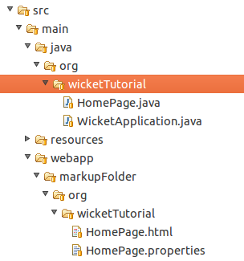
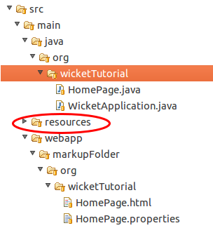

Wicket loads application's resources delegating this task to a resource locator represented by interface _org.apache.wicket.core.util.resource.locator.IResourceStreamLocator_. To retrieve or modify the current resource locator we can use the getter and setter methods defined by setting class _ResourceSettings_:

[source,java]
----
  //init application's method
  @Override
  public void init(){   
    //get the resource locator 
    getResourceSettings().getResourceStreamLocator();
    //set the resource locator    
    getResourceSettings().setResourceStreamLocator(myLocator);
  }
----

The default locator used by Wicket is class _ResourceStreamLocator_ which in turn tries to load a requested resource using a set of implementations of interface _IResourceFinder_. This interface defines method _find(Class class, String pathname)_ which tries to resolve a resource corresponding to the given class and path.

The default implementation of _IResourceFinder_ used by Wicket is _ClassPathResourceFinder_ which searches for resources into the application class path. This is the implementation we have used so far in our examples. However some developers may prefer storing markup files and other resources in a separate folder rather than placing them side by side with Java classes. 

To customize resource loading we can add further resource finders to our application in order to extend the resource-lookup algorithm to different locations. Wicket already comes with two other implementations of IResourceFinder designed to search for resources into a specific folder on the file system. The first is class _Path_ and it's defined in package _org.apache.wicket.util.file_. The constructor of this class takes in input an arbitrary folder that can be expressed as a string path or as an instance of Wicket utility class _Folder_ (in package _org.apache.wicket.util.file_). The second implementation of interface _IResourceFinder_ is class _WebApplicationPath_ which looks into a folder placed inside webapp's root path (but not inside folder WEB-INF).

Project CustomFolder4MarkupExample uses _WebApplicationPath_ to load the markup file and the resource bundle for its home page from a custom folder. The folder is called markupFolder and it is placed in the root path of the webapp. The following picture illustrates the file structure of the project:

As we can see in the picture above, we must preserve the package structure also in the custom folder used as resource container. The code used inside application class to configure  WebApplicationPath is the following:

[source,java]
----
@Override
public void init()
{
	getResourceSettings().getResourceFinders().add(
			new WebApplicationPath(getServletContext(), "markupFolder"));
}
----

Method getResourceFinders() defined by setting class ResourceSettings returns the list of  resource finders defined in our application. The constructor of WebApplicationPath takes in input also an instance of standard interface javax.servlet.ServletContext which can be retrieved with WebApplication's method getServletContext().

NOTE: By default, if resource files can not be found inside application classpath, Wicket will search for them inside “resources” folder. You may have noted this folder in the previous picture. It is placed next to the folder “java” containing our source files:

This folder can be used to store resource files without writing any configuration code.

