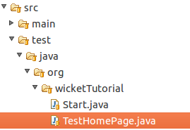

A good way to start getting confident with Wicket unit testing support is looking at the test case class _TestHomePage_ that is automatically generated by Maven when we use Wicket archetype to create a new project:

Here is the content of TestHomePage:

[source,java]
----
public class TestHomePage{
	private WicketTester tester;

	@Before
	public void setUp(){
		tester = new WicketTester(new WicketApplication());
	}
	@Test
	public void homepageRendersSuccessfully(){
		//start and render the test page
		tester.startPage(HomePage.class);
		//assert rendered page class
		tester.assertRenderedPage(HomePage.class);
	}
}
----

The central class in a Wicket testing is _org.apache.wicket.util.tester.WicketTester_. This utility class provides a set of methods to render a component, click links, check if page contains a given component or a feedback message, and so on.

The basic test case shipped with _TestHomePage_ illustrates how _WicketTester_ is typically instantiated (inside method _setUp()_). In order to test our components, WicketTester needs to use an instance of _WebApplication_. Usually, we will use our application class as _WebApplication_, but we can also decide to build WicketTester invoking its no-argument constructor and letting it automatically build a mock web application (an instance of class _org.apache.wicket.mock.MockApplication_).

The code from _TestHomePage_ introduces two basic methods to test our pages. The first is method _startPage_ that renders a new instance of the given page class and sets it as current rendered page for WicketTester. The second method is assertRenderedPage which checks if the current rendered page is an instance of the given class. In this way if TestHomePage succeeds we are sure that page HomePage has been rendered without any problem. The last rendered page can be retrieved with method _getLastRenderedPage_.

That's only a taste of what _WicketTester_ can do. In the next paragraphs we will see how it can be used to test every element that composes a Wicket page (links, models, behaviors, etc...).

=== Testing links

A click on a Wicket link can be simulated with method _clickLink_ which takes in input the link component or the page-relative path to it.

To see an example of usage of clickLink, let's consider again project _LifeCycleStagesRevisited_. As we know from chapter 5 the home page of the project alternately displays two different labels (“First label” and “Second label”), swapping between them each time button  [reload] is clicked. The code from its test case checks that label has actually changed after button  [reload] has been pressed:

[source,java]
----
//...
@Test
public void switchLabelTest(){
	//start and render the test page
	tester.startPage(HomePage.class);
	//assert rendered page class
	tester.assertRenderedPage(HomePage.class);
	//assert rendered label
	tester.assertLabel("label", "First label");
	//simulate a click on "reload" button
	tester.clickLink("reload");
	//assert rendered label
	tester.assertLabel("label", "Second label");	
}
//...
----

In the code above we have used _clickLink_ to click on the  [reload] button and force page to be rendered again. In addition, we have used also method _assertLabel_ that checks if a given label contains the expected text.

By default _clickLink_ assumes that AJAX is enabled on client side. To switch AJAX off we can use another version of this method that takes in input the path to the link component and a boolean flag that indicates if AJAX must be enabled (true) or not (false). 

[source,java]
----
//...
//simulate a click on a button without AJAX support
tester.clickLink("reload", false);
//...
----

=== Testing component status

WicketTester provides also a set of methods to test the states of a component. They are:

* *assertEnabled(String path)/assertDisabled(String path)*: they test if a component is enabled or not.
* *assertVisible(String path)/assertInvisible(String path)*: they test component visibility.
* *assertRequired(String path)*: checks if a form component is required.

In the test case from project _CustomDatepickerAjax_ we used _assertEnabled_/_assertDisabled_ to check if button  [update] really disables our datepicker:  

[source,java]
----
//...
@Test
public void testDisableDatePickerWithButton(){
	//start and render the test page
	tester.startPage(HomePage.class);
	//assert that datepicker is enabled
	tester.assertEnabled("form:datepicker");
	//click on update button to disable datepicker
	tester.clickLink("update");
	//assert that datepicker is disabled
	tester.assertDisabled("form:datepicker");		
}
//...
----

=== Testing components in isolation

Method _startComponent(Component)_ can be used to test a component in isolation without having to create a container page for this purpose. The target component is rendered and both its methods _onInitialize()_ and _onBeforeRender()_ are executed. In the test case from project _CustomFormComponentPanel_ we used this method to check if our custom form component correctly renders its internal label:

[source,java]
----
//...
@Test
public void testCustomPanelContainsLabel(){
	TemperatureDegreeField field = new TemperatureDegreeField("field", Model.of(0.00));
	//Use standard JUnit class Assert	
	Assert.assertNull(field.get("mesuramentUnit"));		
	tester.startComponent(field);		
	Assert.assertNotNull(field.get("mesuramentUnit"));
}
//...
----

If test requires a page we can use _startComponentInPage(Component)_ which automatically generates a page for our component.

=== Testing the response

_WicketTester_ allows us to access to the last response generated during testing with method _getLastResponse_. The returned value is an instance of class MockHttpServletResponse that provides helper methods to extract informations from mocked request. 

In the test case from project _CustomResourceMounting_ we extract the text contained in the last response with method _getDocument_ and we check if it is equal to the RSS feed used for the test: 

[source,java]
----
//...
@Test
public void testMountedResourceResponse() throws IOException, FeedException{tester.startResource(new RSSProducerResource());
	String responseTxt = tester.getLastResponse().getDocument();
	//write the RSS feed used in the test into a ByteArrayOutputStream
	ByteArrayOutputStream outputStream = new ByteArrayOutputStream();
	Writer writer = new OutputStreamWriter(outputStream);
	SyndFeedOutput output = new SyndFeedOutput();
       	
	output.output(RSSProducerResource.getFeed(), writer);
	//the response and the RSS must be equal 
	Assert.assertEquals(responseTxt, outputStream.toString());
}
//...
----

To simulate a request to the custom resource we used method _startResource_ which can be used also with resource references.

=== Testing URLs

_WicketTester_ can be pointed to an arbitrary URL with method _executeUrl(String url)_. This can be useful to test mounted pages, resources or request mappers:

[source,java]
----
//...
//the resource was mapped at '/foo/bar'
tester.executeUrl("./foo/bar");	
//...
----

=== Testing AJAX components

If our application uses AJAX to refresh components markup, we can test if _AjaxRequestTarget_ contains a given component with _WicketTester_'s method _assertComponentOnAjaxResponse_:

[source,java]
----
//...
//test if AjaxRequestTarget contains a component (using its instance)
tester.assertComponentOnAjaxResponse(amountLabel);	
//...
//test if AjaxRequestTarget contains a component (using its path)
tester.assertComponentOnAjaxResponse("pathToLabel:labelId");
----

It's also possible to use method _isComponentOnAjaxResponse(Component cmp)_ to know if a component has been added to _AjaxRequestTarget_:

[source,java]
----
//...
//test if AjaxRequestTarget does NOT contain amountLabel 
assertFalse(tester.isComponentOnAjaxResponse(amountLabel));	
//...
----

=== Testing AJAX events

Behavior _AjaxEventBehavior_ and its subclasses can be tested simulating AJAX events with _WicketTester_'s method _executeAjaxEvent(Component cmp, String event)_. Here is the sample code from project _TestAjaxEventsExample_:

*Home page code:*

[source,java]
----
public class HomePage extends WebPage {
 public static String INIT_VALUE = "Initial value";
 public static String OTHER_VALUE = "Other value";
	
 public HomePage(final PageParameters parameters) {
	super(parameters);
	Label label;
	add(label = new Label("label", INIT_VALUE));				
	label.add(new AjaxEventBehavior("click") {
			
		@Override
		protected void onEvent(AjaxRequestTarget target) {
			//change label's data object
			getComponent().setDefaultModelObject(
                                                  OTHER_VALUE);
			target.add(getComponent());
		}
	}).setOutputMarkupId(true);
	//...
 }
}
----

*Test method:*

[source,java]
----
@Test
public void testAjaxBehavior(){
	//start and render the test page
	tester.startPage(HomePage.class);
	//test if label has the initial expected value
	tester.assertLabel("label", HomePage.INIT_VALUE);		
	//simulate an AJAX "click" event
	tester.executeAjaxEvent("label", "click");
	//test if label has changed as expected
	tester.assertLabel("label", HomePage.OTHER_VALUE);
}
----

=== Testing AJAX behaviors

To test a generic AJAX behavior we can simulate a request to it using _WicketTester_'s method _executeBehavior(AbstractAjaxBehavior behavior)_:

[source,java]
----
//...
AjaxFormComponentUpdatingBehavior ajaxBehavior = 
		new AjaxFormComponentUpdatingBehavior("change"){
	@Override
	protected void onUpdate(AjaxRequestTarget target) {
		//...				
	}
};
component.add(ajaxBehavior);
//...
//execute AJAX behavior, i.e. onUpdate will be invoked 
tester.executeBehavior(ajaxBehavior));	
//...
----

=== Using a custom servlet context

In [paragraph 16.13|guide:resources_13] we have seen how to configure our application to store resource files into a custom folder placed inside webapp root folder (see project _CustomFolder4MarkupExample_). 

In order to write testing code for applications that use this kind of customization, we must tell _WicketTester_ which folder to use as webapp root. This is necessary as under test environment we don't have any web server, hence it's impossible for _WicketTester_ to retrieve this parameter from servlet context.

Webapp root folder can be passed to _WicketTester_'s constructor as further parameter like we did in the test case of project _CustomFolder4MarkupExample_:

[source,java]
----
public class TestHomePage{
   private WicketTester tester;

   @Before
   public void setUp(){
      //build the path to webapp root folder   
      File curDirectory = new File(System.getProperty("user.dir"));
      File webContextDir = new File(curDirectory, "src/main/webapp");
      
      tester = new WicketTester(new WicketApplication(), webContextDir.getAbsolutePath());
   }
   //test methods...
}
----

NOTE: After a test method has been executed, we may need to clear any possible side effect occurred to the _Application_ and _Session_ objects. This can be done invoking _WicketTester_'s method _destroy()_:

[source,java]
----
@After
public void tearDown(){
	//clear any side effect occurred during test.
	tester.destroy();
}
----

